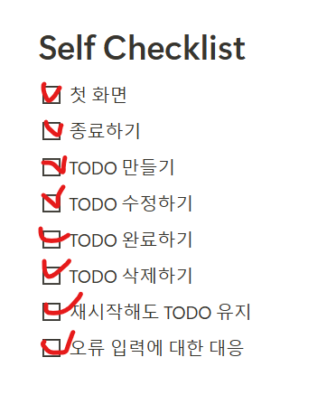

# 1.실행방법:
- Class "Main"에서 실행한다.
# 2.쓰는 기술:
- 객체와 클래스  
- 생성자
- 메서드  
- 예외처리 : try catch  
- Collections Framework : List<E>..  
- FileReader , FileWriter, StringBuilder.
# 3. 고민했던 문제
- List를 Date으로 정리  (지금까지 아직 해결 못 한다. T_T )
- 내용은 완성하고 시간 지나면 자동으로 삭제하는 방법 (지금까지 아직 해결 못 한다. T_T )
- Array와 Collections (특히 conllections) 
# 4.완수한 요구사항

!